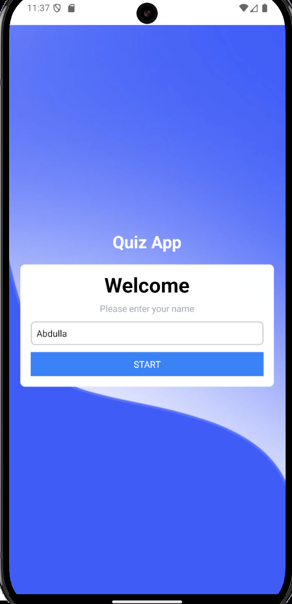
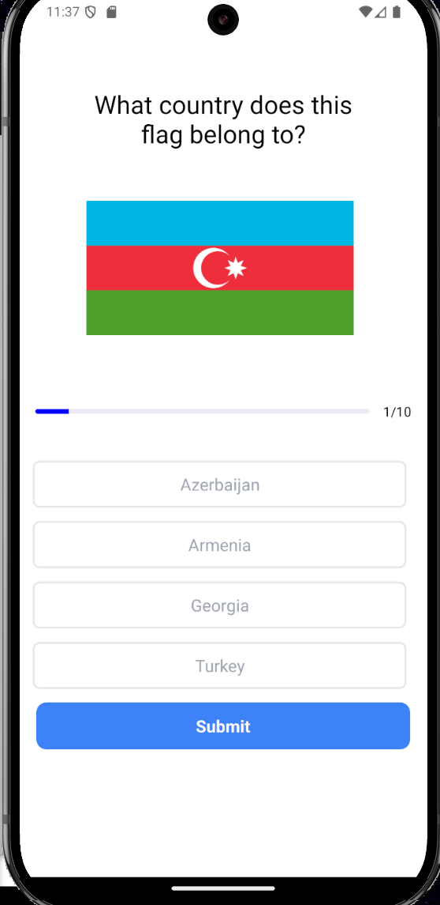
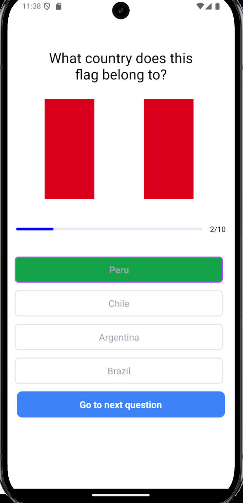
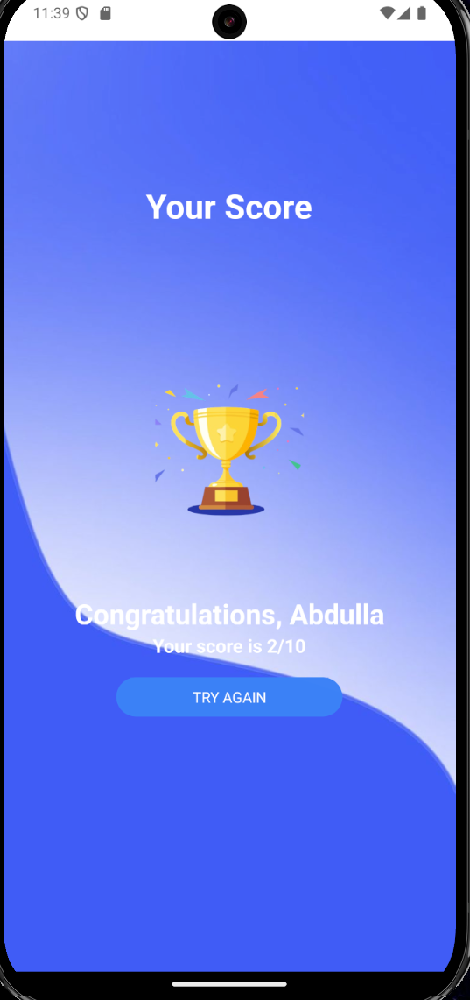

# 🏁 Flag Finder Mobile App

Welcome to **Flag Finder**, a simple React Native app designed for fun and learning! This app challenges you to find flags and test your geographical knowledge. 🌍🌟

## 📸 Screenshots

Here’s a sneak peek at the app! 👀👇

  
  
  




## 🎨 Design Inspiration

The design of this app was inspired by the amazing [Quiz App](https://github.com/walissonsilva/quiz-app-kotlin) by Walisson Silva. Big thanks to the creator! 💡👏

## 🚀 Features

- Interactive gameplay 🕹️
- Sleek and user-friendly design 🎯
- Educational and entertaining 🌟

## 🛠️ Tech Stack

- **React Native** 📱
- **JavaScript** 🛠️

## How to run

```bash
   git clone https://github.com/abdullaabdullazade/flag-finder.git
   cd flag-finder
   npm i
   npm start
```

---

# 🏁 Bayraqları Tap Mobile App

**Bayraqları Tap** tətbiqinə xoş gəldiniz! Bu sadə React Native tətbiqi ilə həm əylənin, həm də öyrənin! Bu tətbiq sizin coğrafiya biliklərinizi yoxlayır. 🌍✨

## 📸 Ekran Görüntüləri

Tətbiqin görüntüləri 👀👇

  
  
  
  


## 🎨 Dizaynın İlhamı

Tətbiqin dizaynı [Quiz App](https://github.com/walissonsilva/quiz-app-kotlin) layihəsindən götürülüb. Yaradıcısına təşəkkürlər! 💡👏

## 🚀 Xüsusiyyətlər

- İnteraktiv oyun təcrübəsi 🕹️
- Şık və istifadəçi dostu dizayn 🎯
- Təhsil və əyləncə bir arada 🌟

## 🛠️ Texnoloji Yığın

- **React Native** 📱
- **JavaScript** 🛠️

## Necə çalışdıra bilərəm?

```bash
   git clone https://github.com/abdullaabdullazade/flag-finder.git
   cd flag-finder
   npm i
   npm start
```
